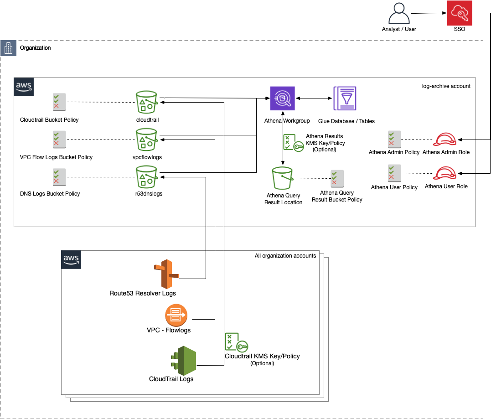
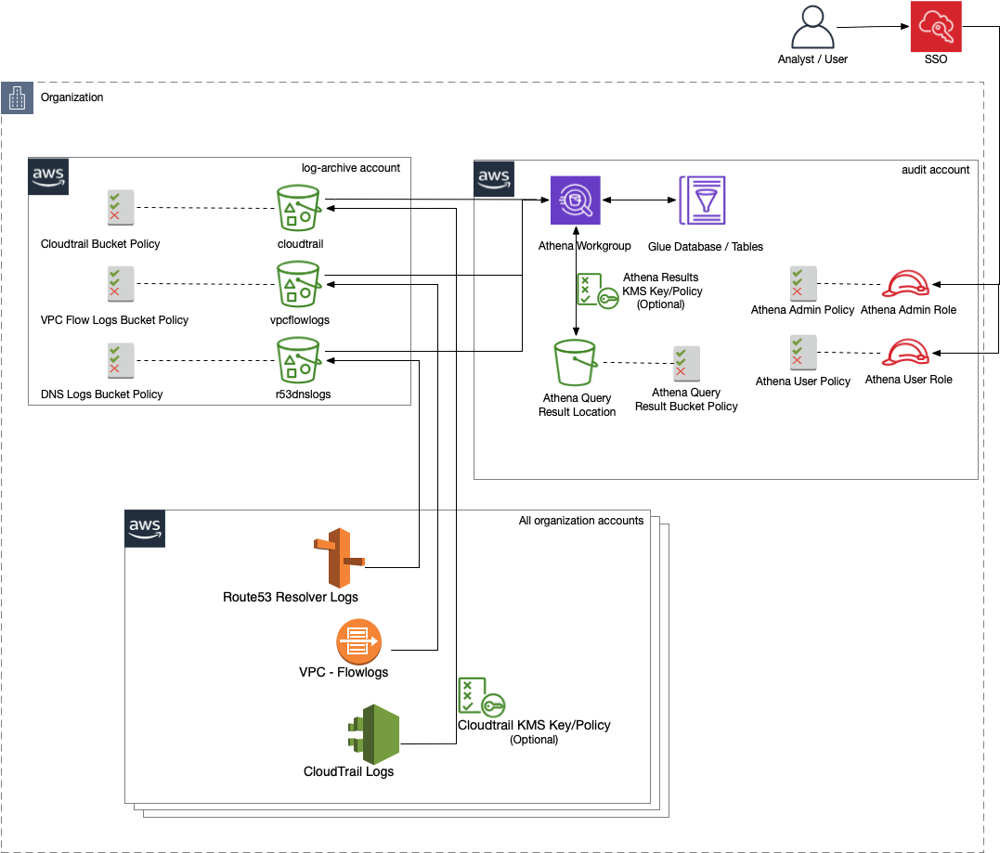

# AWS Security Analytics Bootstrap

AWS Security Analytics Bootstrap enables customers to perform security investigations on AWS service logs by providing an Amazon Athena analysis environment that's quick to deploy, ready to use, and easy to maintain. 

If you're ready to deploy Athena Analytics Bootstrap, jump directly to [Deploying AWS Security Analytics Bootstrap](#deploying-aws-security-analytics-bootstrap)

## AWS Security Analytics Bootstrap Use Cases
AWS Security Analytics Bootstrap is for Amazon Web Services (AWS) customers who need a quick method to setup Athena and perform investigations on AWS service logs archived in Amazon S3 buckets.  

AWS Security Analytics Bootstrap is designed to be ready to use for common security investigation use-cases, quick to deploy, and easy to maintain.  AWS Security Analytics Bootstrap provides AWS CloudFormation templates to quickly create a fully configured Athena analysis environment including an Amazon Athena Workgroup, AWS Glue Databases, AWS Glue Tables, and Demo Athena Queries.  AWS Security Analytics Bootstrap supports common security investigation requirements including partitioning and searches across multiple accounts, regions, and dates.  AWS Security Analytics Bootstrap uses [Partition Projection with Amazon Athena](https://docs.aws.amazon.com/athena/latest/ug/partition-projection.html) to provide dynamic partitioning across accounts, regions, and dates without any additional infrastructure, code or frequent maintenance.  Partitioning AWS service log data by account, region, and/or date will enable AWS customers to create targeted queries reducing their cost and query times.

### Common Use Cases for AWS Security Analytics Bootstrap are When AWS Customers:
- Want to search AWS service logs natively in AWS
- Currently have no SIEM available/accessible
- Need to search logs beyond SIEM retention period
- Don't have the required AWS service logs indexed in the SIEM
- Need to investigate an AWS account which hasn't been centralizing its logs

## AWS Service Logs Currently Supported by AWS Security Analytics Bootstrap
 AWS Service Log | Event Type 
------|------|
[AWS CloudTrail](https://docs.aws.amazon.com/cloudtrail/index.html) | AWS API Events (Management and Data Events)
[Amazon Virtual Private Cloud (VPC) Flow Logs](https://docs.aws.amazon.com/vpc/latest/userguide/flow-logs.html) | Network Events
[Amazon Route 53 DNS resolver query logs](https://docs.aws.amazon.com/Route53/latest/DeveloperGuide/resolver-query-logs.html) | DNS Resolution Events

*NOTE:* We will be adding support for additional AWS Service Logs commonly used in security investigations, please feel free to submit or upvote your requests in `Issues`

## AWS Security Analytics Bootstrap Architecture Overview
Single Account Deployment  |  Cross-Account Deployment
:-------------------------:|:-------------------------:
 |  

## Deploying AWS Security Analytics Bootstrap

### Prerequisites
- AWS service logs (e.g. AWS CloudTrail, Amazon VPC Flow Logs, Amazon Route 53 Resolver Query Logs) must be delivered to Amazon S3 buckets unmodified in their native format
- For [cross-account deployments](https://docs.aws.amazon.com/athena/latest/ug/cross-account-permissions.html) bucket policies must be in place and objects need to be owned by the bucket account owner to enable cross-account access
- For logs encrypted via AWS KMS the AWS IAM principal(s) that will be used to submit Athena queries will need to have permissions for `kms:Decrypt` and `kms:DescribeKey` in their IAM policy and the KMS key policy will need to grant them the same access

### Getting Started

The [Athena Infrastructure CloudFormation Template](AWSSecurityAnalyticsBootstrap/cfn/Athena_infra_setup.yml) will deploy a fully functional security analytics environment including:

Resource | Notes
---------|--------
**Athena Workgroup** | - Configured to provide encrypted output to a specified S3 location - Includes pre-configured demo queries as Named Queries
**Glue Database** | - Contains associated Glue Tables
**Glue Tables** | Standardized table schemas with dynamic partitions for account, region, and date for: - CloudTrail Logs - VPC Flow Logs - Route53 DNS Resolver Logs 

**Deployment time:** ~10 minutes

Comments are provided in the CloudFormation Parameters section to assist with the parameters required for deployment, and a detailed walk-through of the deployment process is provided in the [AWS Security Analytics Bootstrap Deployment Guide](AWSSecurityAnalyticsBootstrap/docs/aws_security_analytics_bootstrap_deployment_guide.md).

----
## AWS Security Analytics Bootstrap Resources
*Note:* The [Athena Infrastructure CloudFormation Template](AWSSecurityAnalyticsBootstrap/cfn/Athena_infra_setup.yml) can be deployed by itself or in combination with any of the additional resources depending on customers' use case(s) and requirements.

| Resource Type | Resource | Resource Provides | Cleanup/Removal Notes | 
|  :--- | :---         | :---      |   :---        |    
| AWS CloudFormation Template | [Athena Infrastructure CloudFormation Template](AWSSecurityAnalyticsBootstrap/cfn/Athena_infra_setup.yml)   | Creates the ready-to-use Athena security analytics environment including: Athena Workgroup, Glue Database, Glue Tables, and demo Named Queries.  Comments are provided in the CloudFormation Parameters section to walk customers through deployment or customers can review the [AWS Security Analytics Bootstrap Deployment Guide](AWSSecurityAnalyticsBootstrap/docs/aws_security_analytics_bootstrap_deployment_guide.md) for more detail. | All resources created by this template will be deleted when the CloudFormation Stack is deleted.  This will not affect the source log data. |
| AWS CloudFormation Template | [IAM Roles and Policies for Athena Admin and Athena Analyst](AWSSecurityAnalyticsBootstrap/cfn/Athena_IAM_setup.yml)     | Creates IAM Roles and Policies for a Athena Admin and Athena Analyst Roles designed according to least privilege principals|  All resources created by this template will be deleted when the CloudFormation Stack is deleted. |
| AWS CloudFormation Template | [Enable flow logs](AWSSecurityAnalyticsBootstrap/cfn/VPC_enable_flowlogs.yml)    | Enables VPC Flow Logs for the specified VPC, Subnet, or ENI with [all fields through v5](https://docs.aws.amazon.com/vpc/latest/userguide/flow-logs.html#flow-logs-fields) in the order expected by Athena Bootstrap   | The VPC Flow log configuration will be deleted when the CloudFormation Stack is deleted.  Any logs created will need to be deleted separately from the target S3 bucket if desired. |
| CREATE TABLE SQL Statement |  [AWS CloudTrail Table Schema](AWSSecurityAnalyticsBootstrap/sql/ddl/create_tables/create_cloudtrail_table.sql) | Creates a Glue Table for CloudTrail Logs partitioned by account, region and date via Athena SQL query statement. This table is also created by the [Athena Infrastructure CloudFormation Template](AWSSecurityAnalyticsBootstrap/cfn/Athena_infra_setup.yml); this SQL statement can be used to create a table in an existing Athena environment for adhoc deployment use cases.  "TODO" comments are included above sections which need to be updated with customers' environment details.  |  The table can be deleted with the Athena query statement `DROP TABLE <table name>` (e.g. `DROP TABLE cloudtrail`) | 
| CREATE TABLE SQL Statement |  [Amazon VPC Flow Logs Table Schema](AWSSecurityAnalyticsBootstrap/sql/ddl/create_tables/create_vpcflowlog_table.sql)   | Creates a Glue Table for VPC Flow Logs partitioned by account, region and date via Athena SQL query statement. This table is also created by the [Athena Infrastructure CloudFormation Template](AWSSecurityAnalyticsBootstrap/cfn/Athena_infra_setup.yml); this SQL statement can be used to create a table in an existing Athena environment for adhoc deployment use cases.  "TODO" comments are included above sections which need to be updated with customers' environment details.   | The table can be deleted with the Athena query statement `DROP TABLE <table name>` (e.g. `DROP TABLE vpcflowlogs`) | 
| CREATE TABLE SQL Statement |  [Amazon Route 53 Resolver Query Logs Table Schema](AWSSecurityAnalyticsBootstrap/sql/ddl/create_tables/create_dnsquerylog_table.sql)   | Creates a Glue Table for Route 53 DNS Resolver Logs partitioned by account, VPC ID and date via Athena SQL query statement. This table is also created by the [Athena Infrastructure CloudFormation Template](AWSSecurityAnalyticsBootstrap/cfn/Athena_infra_setup.yml); this SQL statement can be used to create a table in an existing Athena environment for adhoc deployment use cases.  "TODO" comments are included above sections which need to be updated with customers' environment details.   | The table can be deleted with the Athena query statement `DROP TABLE <table name>` (e.g. `DROP TABLE r53dns`) | 
| Demo Athena Queries |  [AWS CloudTrail Demo Queries](AWSSecurityAnalyticsBootstrap/sql/dml/analytics/cloudtrail/cloudtrail_demo_queries.sql)  | Demo Athena queries for CloudTrail Logs. These queries area also created in the Athena Workgroup as Named Queries by the [Athena Infrastructure CloudFormation Template](AWSSecurityAnalyticsBootstrap/cfn/Athena_infra_setup.yml)  | N/A - No resources created | 
| Demo Athena Queries |  [Amazon VPC Flow Log Demo Queries](AWSSecurityAnalyticsBootstrap/sql/dml/analytics/vpcflow/vpcflow_demo_queries.sql)  | Demo Athena queries for VPC Flow Logs. These queries area also created in the Athena Workgroup as Named Queries by the [Athena Infrastructure CloudFormation Template](AWSSecurityAnalyticsBootstrap/cfn/Athena_infra_setup.yml)  | N/A - No resources created | 
| Demo Athena Queries |  [Amazon Route 53 Resolver Query Log Demo Queries](AWSSecurityAnalyticsBootstrap/sql/dml/analytics/dns/dns_demo_queries.sql)  | Demo Athena queries for Route 53 DNS Resolver Logs. These queries area also created in the Athena Workgroup as Named Queries by the [Athena Infrastructure CloudFormation Template](AWSSecurityAnalyticsBootstrap/cfn/Athena_infra_setup.yml) | N/A - No resources created | 

## Currently Out of Scope
- How data is provided to Amazon S3 buckets (e.g. configuration of logs)
- Optimization of the underlying data sources (e.g. merging small files, converting to Parquet/ORC columnar formats)
- Bucket policy updates for cross-account deployments 
- AWS KMS policy updates are currently out of scope

## Cost
By installing AWS Security Analytics Bootstrap, AWS customers may incur charges from the following services:

- Amazon Athena: https://aws.amazon.com/athena/pricing/
- Amazon S3: https://aws.amazon.com/s3/pricing/
- AWS KMS: https://aws.amazon.com/kms/pricing/ 

## Related Resources

### Resources from AWS
- [[Tool] Assisted Log Enabler for AWS](https://github.com/awslabs/assisted-log-enabler-for-aws)
- [[Tool] AthenaGlueService Logs](https://github.com/awslabs/athena-glue-service-logs)
- [[Service] Amazon Detective](https://aws.amazon.com/detective/)
- [[Doc] Running SQL Queries Using Amazon Athena](https://docs.aws.amazon.com/athena/latest/ug/querying-athena-tables.html)
- [[Doc] Querying AWS Service Logs](https://docs.aws.amazon.com/athena/latest/ug/querying-AWS-service-logs.html)
- [[Blog] Analyze Security, Compliance, and Operational Activity Using AWS CloudTrail and Amazon Athena](https://aws.amazon.com/blogs/big-data/)
- [[Blog] Athena Performance Tips](https://aws.amazon.com/blogs/big-data/top-10-performance-tuning-tips-for-amazon-athena/)
- [[Q&A] CTAS Bucketing Guidance](https://aws.amazon.com/premiumsupport/knowledge-center/set-file-number-size-ctas-athena/)
- [[Blog] Amazon Route 53 Resolver Query Logs](https://aws.amazon.com/blogs/aws/log-your-vpc-dns-queries-with-route-53-resolver-query-logs)
- [[Doc] Configure Amazon Route 53 Resolver Query Logs](https://console.aws.amazon.com/route53resolver/home/query-logging#/query-logging/configure) (choose Amazon S3 destination)
- [[Doc] Security Reference Architecture: Log Archive Account](https://docs.aws.amazon.com/prescriptive-guidance/latest/security-reference-architecture/log-archive.html) 

### Third Party Resources
- [[Guide] The Athena Guide](https://the.athena.guide/)
- [[Doc] Presto Documentation (current)](https://prestodb.io/docs/current/)
- [[Book] Presto The Definitive Guide (e-book)](https://www.starburst.io/wp-content/uploads/2020/04/OReilly-Presto-The-Definitive-Guide.pdf)

## Contributors
AWS Security Analytics Bootstrap stands on the shoulders of countless giants and has benefited from the assistance of *MANY* collaborators and contributors.  Thanks to everyone who has helped or inspired the project so far and thanks in advance to any future contributions.

Many thanks for your contributions:
- Bohan Li
- Brian Andrzejewski
- Brian Poole
- Casey Reniker
- Clayton Darnell
- Cydney Stude
- Freddy Kasprzykowski
- Jason Hurst
- Jonathon Poling
- Joshua McKiddy
- Justin Fry
- Kyle Dickinson
- Luis Maldonado
- Matt Gurr
- Matt Helgen
- Matthew Harvey
- Pathik Shah
- Ravi Sankar Prasad Kadiri
- Richard Billington
- Srinivas Ananda Babu
- Theo Tolv

## Security

See [CONTRIBUTING](CONTRIBUTING.md#security-issue-notifications) for more information.

## License

This project is licensed under the Apache-2.0 License.

